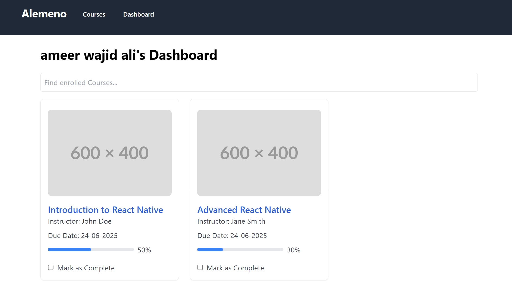
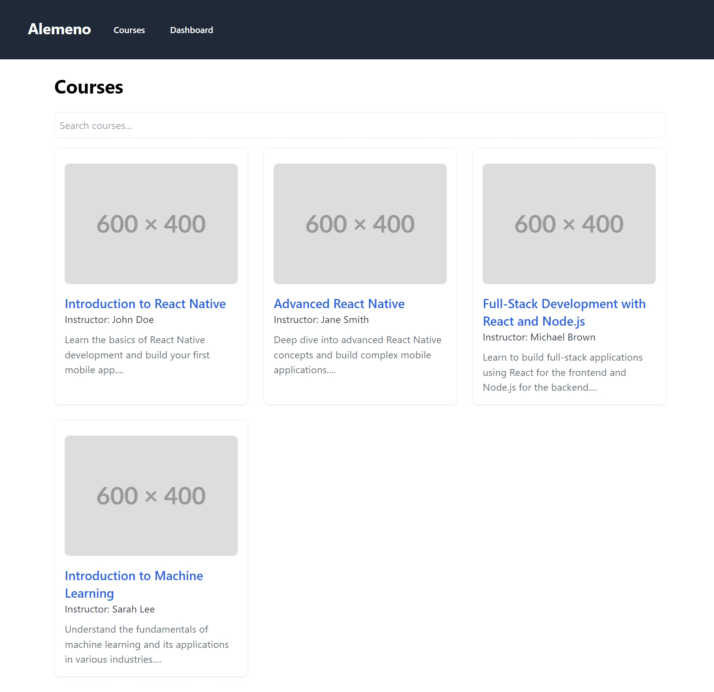
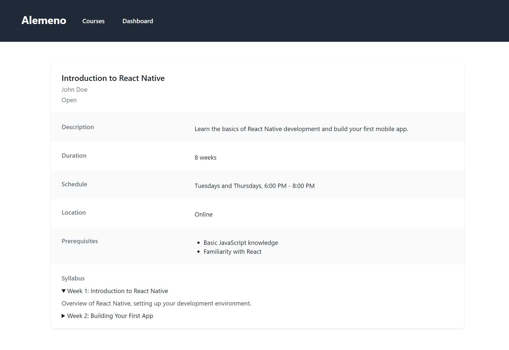

# Alemeno Assignment

This is an assignment project given by Alemeno to assess technical skills. The project includes the implementation of the following features:

- **Student Dashboard**: Dashboard displaying enrolled courses with additional features:
  - Ability to mark courses as complete
  - Progress bar
  - Due date

- **Courses Listing**: Shows all available courses on the site.

- **Course Details**: Displays detailed course information including:
  - Course name
  - Instructor's name
  - Description
  - Enrollment status (e.g., 'Open', 'Closed', 'In Progress')
  - Course duration
  - Schedule
  - Location
  - Pre-requisites
  - Syllabus as an expandable item

## Prerequisites

Make sure you have the following software installed:

- Node.js (version 14 or higher)
- npm (version 6 or higher)

## How to Run

Clone the repository:
```sh
git clone https://github.com/ameer-w-ali/alemeno-assignment.git
cd alemeno-assignment
```

Install dependencies:
```sh
npm install
```

To run the backend server with json-server:
```sh
npx json-server --watch db.json --port 3000
```

To run the frontend:
```sh
npm run dev
```

### Project Structure
- public/: Contains public assets like the index.html.
- src/: Contains the source code for the React application.
  - components/: Contains reusable components.
  - pages/: Contains page components.
  - store/: Contains Redux store setup and reducers.
  - App.jsx: Main application component.
  - main.jsx: Entry point for the React application.
- db.json: Mock database file used by json-server.

### Screenshots
Here are some screenshots of the application:
#### Dashboard

#### Courses

#### Course Details


## Important NOtes
- Ensure the backend server is running (npx json-server --watch db.json --port 3000) before starting the frontend development server (npm run dev) to avoid API call issues.
- The project uses Redux for state management. Understand the Redux store setup and reducers for managing state across the application.